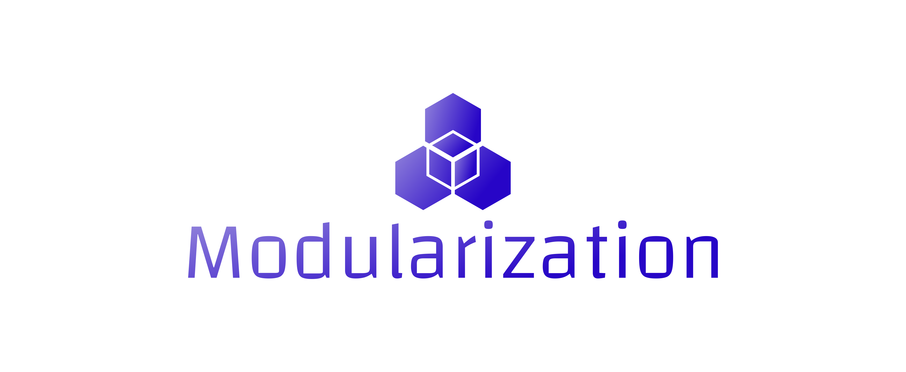

# logo.modularization.dev

blog

## Font

Font in use <a target="_blank" href="https://www.fontsquirrel.com/fonts/changa">Changa-Light</a> designed by
<a target="_blank" href="http://www.tipo.net.ar/">Eduardo Tunni</a>
and licensed under
<a target="_blank" href="http://scripts.sil.org/cms/scripts/page.php?site_id=nrsi&amp;id=OFL_web">Open Font License.</a>
  Icon Designed by
  <a target="_blank" href="https://thenounproject.com/mikicon">mikicon</a>
  
  
  
# Colors   

## Font
  
    #9284DB, #2705C7

## Background
    
    transparent

## Icon

    #9284DB, #2705C7

# logo

## 1

## 2

          
